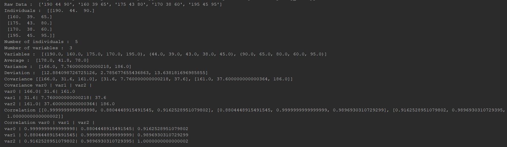
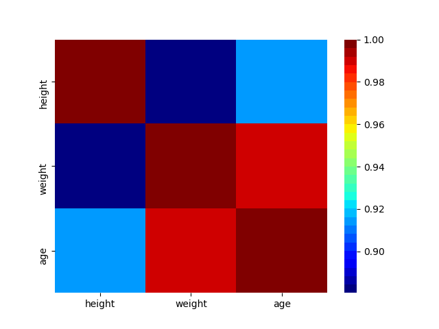

# data_analysing
a script that clean and analyses numerical data 
to extract interesting data (Average, Variance, Deviation, Covariance, Correlation)

# Result Example :

heatmap showing the correlation between different variables : 

# usage : 
Install the missing libs from the requirements.txt file

your data in the source.txt file (there is some exapmles in source.txt and source1.txt)

python my_main to start the script.
